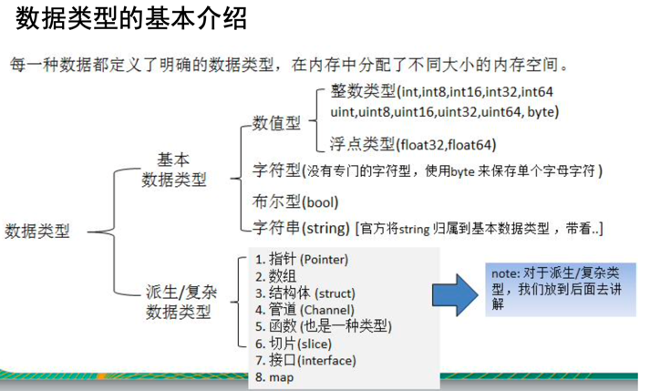
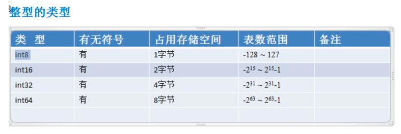
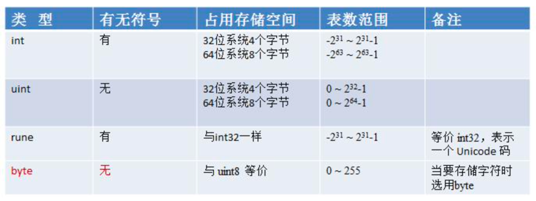
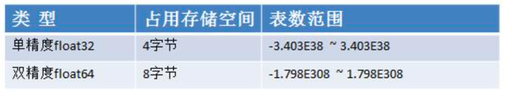

##### 使用变量的三种方式 

- 指定变量类型，声明后不赋值，使用默认值
```go
    // 默认值为0
    var i int
    fmt.Println(i)
```

- 根据值自行判断变量类型（类型推导）
```go
    var j = 12.43
    fmt.Println(j)
```

- 省略var,:=左侧的变量不能是已经声明过了的，否则会编译错误
```go
    name := "Tom"
    fmt.Println(name)
```

- 声明多个变量
```go
    var n1, n2, n3 int
    fmt.Println(n1, n2, n3)

    a, b, c := 100, "a", 12.32
    fmt.Println(a, b, c)

    var (
        x = 1
        y = "v"
        z = 32.344444
    )
    fmt.Println(x, y, z)
```

##### 数据类型


- 基本数据类型
    - 数值型
        - 整型类型
          
          
          此外还有两种整数类型 int 和 uint，它们分别对应特定 CPU 平台的字长（机器字大小）

          |类型|有无符号|占用存储空间|表数范围|备注|
          |:----:|:---:|:---:|:---:|:---:|
          |int8|有|1字节|-128～127||
          |int16|有|2字节|-2^15～2^15-1||
          |int32|有|4字节|-2^31～2^31-1||
          |int64|有|8字节|-2^63～2^63-1||
          |uint8|无|1字节|0～255||
          |uint16|无|2字节|0～2^16-1||
          |uint32|无|4字节|0～2^32-1||
          |uint64|无|8字节|0～2^64-1||
          |int|有|32位系统4字节 或者 64位系统8个字节|-2^31～2^31-1 或者 -2^63～2^63-1||
          |uint|无|32位系统4字节 或者 64位系统8个字节|0～2^32-1 或者 0～2^64-1||
          |rune|有|和int32一样|-2^31～2^31-1|等价int32,表示一个 Unicode码|
          |byte|无|和uint8一样|0～255|当要存储字符时选用byte|
        - 浮点数
        
          
    - 字符型
    - 布尔型
    - 字符串
- 派生/复杂数据类型
    - 指针
    - 数组
    - 结构体
    - 管道
    - 函数
    - 切片
    - 接口
    - map
    

